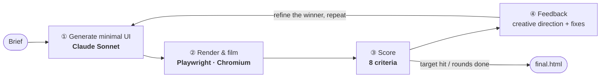
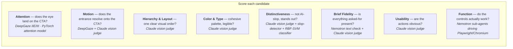

# AutoDesign — overview

**Describe a UI in one sentence → AutoDesign builds it, grades it on 8 criteria, and improves it every round.**

It starts from a deliberately *minimal* page, then a panel of evaluators (vision models,
an attention model, agentic browser tests, and a perceptual classifier) tells it what to
fix and — more importantly — what bold design moves to try next. Repeat until it's good.

## The loop

## The 8 criteria — and the technology behind each

## Technology legend

| Tech | Role |
|---|---|
| **Claude** (Sonnet) | Generates the UI, and acts as the **vision judge** that drives most design criteria + the creative direction for the next round |
| **DeepGaze IIE/III** (PyTorch) | Predicts human visual **attention** (heatmap + scanpath) — powers Attention & Motion |
| **Nemotron** (via Nebius) | **Sub-agents** that autonomously drive a headless browser to **stress-test interactions** (Function), and a text check for Brief Fidelity |
| **Playwright · Chromium** | Renders each candidate, films the entrance animation, and is the browser the agents drive |
| **slop-detector + scikit-learn SVM** | Flags AI-builder fingerprints and scores the perceptual "award-winning vs slop" fingerprint (Distinctiveness) |
| **Claude research agent + web search** | Finds real competitor sites so the judge can score **originality** (part of Distinctiveness) |
