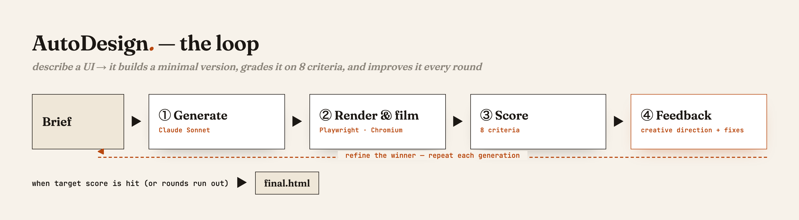

# AutoDesign

An evaluation-driven UI generator. Describe a UI in one sentence; the `/autodesign` loop
builds a minimal version, scores it on 8 criteria with a panel of real evaluators (a
vision judge, an attention model, agentic browser tests, and a perceptual classifier),
and improves the winner every generation. A read-only dashboard reads run artifacts from
disk. See [OVERVIEW.md](OVERVIEW.md) for the full diagrams.



## The 8 scoring criteria

Each candidate is graded on these. The combined score is a weighted blend; the dashboard
groups the underlying ~18 metrics into these 8 buckets.

| Criterion | What it checks | Core technology |
|---|---|---|
| **Attention** | Does predicted gaze land on the intended CTA, with a clean scan path? | DeepGaze IIE/III (PyTorch attention model) |
| **Motion** | Does the entrance animation resolve attention *onto* the CTA? | DeepGaze + Claude vision judge |
| **Hierarchy & Layout** | One clear focal order; disciplined spacing and alignment | Claude vision judge |
| **Color & Type** | Cohesive palette, legible contrast, consistent type | Claude vision judge |
| **Distinctiveness** | Not generic AI-slop; stands out from real competitors | Claude vision judge + slop-detector + RBF-SVM classifier |
| **Brief Fidelity** | Is every element/feature the brief asked for actually present? | Nemotron text check + Claude vision judge |
| **Usability** | Are the interactive elements obvious and unambiguous? | Claude vision judge |
| **Function** | Do the buttons and links actually work in a real browser? | Nemotron sub-agents driving Playwright/Chromium |

> `Distinctiveness`'s originality sub-signal and `Brief Fidelity`/`Function`'s Nemotron
> signals are optional — they activate when a competitor-research agent / `NEBIUS_API_KEY`
> are available, and skip gracefully otherwise.

## How to run

```bash
pip install -r requirements.txt
python -c "import pipeline, pipeline.signals"   # all signal stubs self-register
python -m pytest tests/test_scaffold.py         # smoke test
python dashboard/serve.py                        # empty-state dashboard
```

## Extensibility contract

The scaffold is designed so common changes touch exactly one place:

- **Add an evaluation**: drop a new file in `pipeline/signals/<name>.py` with a class
  decorated by `@register_signal` whose `key` matches a new entry in the
  `criteria:` block of `autodesign.md`. Nothing else changes — `pipeline/signals/__init__.py`
  auto-imports the module, the registry picks it up, and the benchmark combiner runs
  it whenever the key is in config.
- **Swap or restyle the UI**: edit only `dashboard/`. It consumes the
  `GET /api/run/<id>` manifest contract and the `.autodesign/runs/<id>/` directory
  layout, nothing else.
- **Change models / cost tiers**: edit the `models:` block in `autodesign.md` and the
  frontmatter of `.claude/agents/*.md`. No code changes.

## Architecture invariants

1. **Pluggable evaluations.** Every signal implements the `Signal` protocol and
   self-registers via `@register_signal`.
2. **Engine / presentation decoupling.** The loop only writes artifacts to disk; the
   dashboard only reads them through the manifest API.
3. **Disk-as-contract.** All run state lives under `.autodesign/runs/<id>/`. No
   in-memory passing between the loop and the UI. Runs are replayable.
4. **Config-driven.** Behavior comes from the yaml block in `autodesign.md`. No
   hardcoded weights or model names in code.
5. **Model-tiering ready.** Each agentic step is a separate Claude Code subagent so
   models can be assigned independently.
