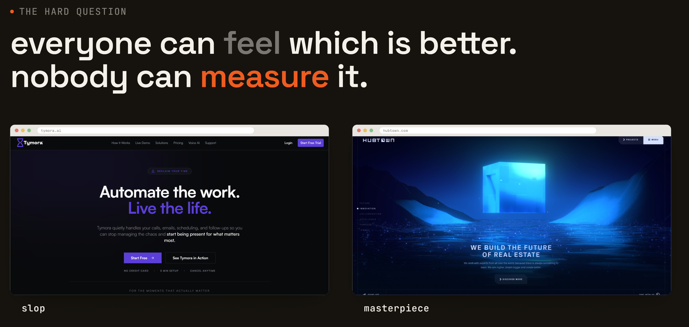
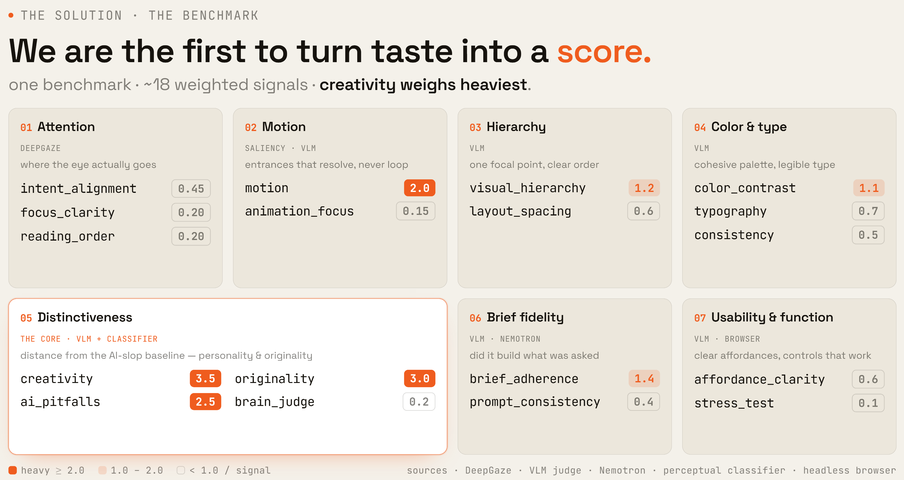

# AutoDesign

**benchmarking the slop out of AI.**

AI generates interfaces fast but almost all of it looks the same. Everyone can *feel*
which UI is better. Nobody can *measure* it. AutoDesign is a benchmark and an agent loop
that does. By Marom and Oliver.

> Leaderboard: **[View the live leaderboard →](https://maroms-mac-mini.tailf108b0.ts.net/)**


---

## Why

Karpathy framed *autoresearch* — agents that run their own experiments against a
benchmark and climb it. The piece that was missing for **UIs** was the benchmark
itself. There is no widely-accepted, automatic, multi-signal scoring rubric for
generated web UI. Without one, every "AI website builder" converges to the same
purple-gradient slop, because the only feedback signal is human vibes.

We built the rubric, the scorer, and the agent loop that climbs it.



---

## The benchmark (the part nobody had built)

A candidate's score is a weighted blend of **~18 signals grouped into 8 buckets** (defined
in [`autodesign.md`](autodesign.md)) — creativity weighs heaviest. What powers each:

- **Attention & Motion** — [DeepGaze](https://github.com/matthias-k/DeepGaze), a pretrained
  gaze model, predicts *where a real viewer's eye would land*, and whether the entrance
  animation resolves that attention onto the CTA.
- **Hierarchy · Color & Type · Usability** — **Claude as a vision judge** scores the rendered
  page against a UX rubric.
- **Distinctiveness** — how far the design is from generic AI-slop: the vision judge + a
  research agent that fetches real competitors + **`brain_judge`**, an SVM we trained (below).
- **Brief fidelity** — a **Nemotron** text check confirms every element the brief asked for
  actually shipped.
- **Function** — **Nemotron sub-agents** drive a real headless browser (click / type / read)
  to verify the controls actually work.

Claude agents generate each candidate UI; the vision judge then turns these scores into the
creative direction + fixes that drive the next round.



### The model we trained: `brain_judge`

An SVM we trained to tell **good, hand-crafted websites apart from AI-generated slop**.
It's an RBF SVM (**CV-AUC 0.85**) over interpretable perceptual features — clutter,
colorfulness, whitespace, contrast, symmetry, hue-entropy — trained on **awwwards winners
(good) vs. madewithlovable / Lovable pages (AI-generated)**. It scores how much a candidate
*looks* designed vs. templated, and plugs into the loop as a single `Signal`.
[`pipeline/brain/`](pipeline/brain/).

---

## The agent loop


- **One file owns behavior** — [`autodesign.md`](autodesign.md). YAML at the bottom
  drives the brief, model tiers, signal weights, focal bbox, and capture.
- **Signals are pluggable.** New evaluation = new file in
  [`pipeline/signals/`](pipeline/signals/) + a line in `criteria:`.
- **Critic owns the plan, generator executes.** Critic reads `scores.json` +
  `saliency.png`, picks the 1–3 lowest sub-scores, emits surgical
  `nameable_decisions` (selector, property, target value). Stops system-level
  rewrites that tank everything at once.
- **Disk-as-contract.** Loop only writes to `.autodesign/runs/<id>/`. Dashboard
  only reads. They never share memory; runs are fully replayable.


---

## Cost / quality trade-offs

Every signal and agent gets the *cheapest model that still works* for that job.
This is wired in [`autodesign.md`](autodesign.md) → `models:` and per-signal
overrides, not hard-coded.

| Job | Model | Why |
|---|---|---|
| In-loop UI generation (`generator`) | **Claude Sonnet** | needs design taste, and runs every iteration |
| Critic refinement plan (`critic`) | **Claude Sonnet** | structured reasoning over `scores.json` |
| VLM judge — visual rubric + creative direction (`vlm_judge`) | **Claude Sonnet** | the dominant signal (weight 0.8); Sonnet keeps the per-candidate cost down |
| Competitor research for originality (`references`) | **Claude Sonnet** + web search | one cached web-search pass per run |
| Brief-presence text check (`prompt_consistency`) | **Nemotron** (Nebius Token Factory) | pure text comparison — no need to pay frontier rates |
| Headless-browser stress-test sub-agents (`stress_test`) | **Nemotron** (Nebius) | many short tool-call turns; cost adds up fast |
| Attention / saliency (`saliency`) | **DeepGaze IIE/III** (local PyTorch) | no API call — runs on the machine |
| Slop / design classifier (`brain_judge`) | **local scikit-learn SVM** | no API call |

The judge tier is set by `models.judge` in [`autodesign.md`](autodesign.md) (currently
Sonnet; bump it to Opus there for a higher-quality final pass). The Nemotron pair runs on
Nebius Token Factory's OpenAI-compatible endpoint and **skips cleanly** if `NEBIUS_API_KEY`
is unset, so the loop degrades gracefully instead of failing.

### Parallel sub-agents

The `stress_test` signal spawns **N independent Nemotron personas** (first-time
visitor, link auditor, form tester) that each drive a separate headless browser
through `list / click / type / read / back` tool calls and report findings.
Scores are merged. Parallel where the work is independent; sequential where
it isn't.

---

## Agent collaboration

Each reasoning role is a separate Claude Code sub-agent in [`.claude/agents/`](.claude/agents/),
with its own system prompt and its own model tier in frontmatter:

- **`generator`** (sonnet) — builds the HTML
- **`critic`** (sonnet) — reads scores, plans the next iteration
- **`judge`** (sonnet) — VLM rubric pass + the round's creative design direction

Roles are *independently swappable*. Change the model for one role in
[`autodesign.md`](autodesign.md) → `models:` without touching the others.

---

## Run it

```bash
pip install -r requirements.txt

# in Claude Code:
/autodesign
```

The loop reads [`autodesign.md`](autodesign.md), generates a candidate,
refines it across iterations, and stops at `loop.target_score` (default 9.0)
or `loop.iterations`.

Inspect runs:

```bash
python dashboard/serve.py    # read-only dashboard on .autodesign/runs/
```
---

## Repo map

- [`autodesign.md`](autodesign.md) — control surface (brief + yaml config)
- [`pipeline/`](pipeline/) — engine, signal registry, capture
- [`pipeline/signals/`](pipeline/signals/) — pluggable evaluations
- [`pipeline/brain/`](pipeline/brain/) — the trained slop classifier
- [`.claude/agents/`](.claude/agents/) — generator / critic / judge
- [`.claude/skills/autodesign/`](.claude/skills/autodesign/) — loop protocol
- [`dashboard/`](dashboard/) — read-only run viewer
- [`leaderboard/`](leaderboard/) — public leaderboard site
